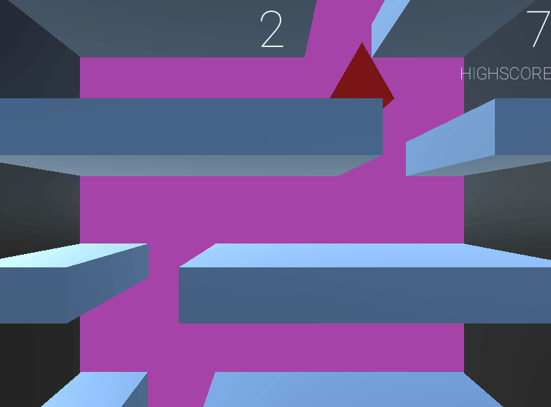

# Fless | Test Project | Endless Faller 

Requires **Unity 2019.4.5f1**. / Windows.

## Opinions

Fless stands for **F**alling End**less** - but also reminds me of what I have most - **stress**. This small but fun project was done in only 5h35m, a record time, at least for me. There may be minor bugs, but no game-changing ones. The overall feel should be the same as for every hyper-casual mobile game nowadays. Executable only on Windows due to IL2CPP.

## Goal 

 

Implement a simple endless falling game where the character must fall between platforms to stay on screen. 

## Requirements

Read the [REQUIREMENTS.md](https://github.com/innerspacetrainings/Application-Endless-Faller/blob/master/REQUIREMENTS.md) before starting.

## Implementation 

- Clone this repository. 
- Develop as you would do in a normal project. 

## Delivery 

### Before implementation 

- Split the requirements into sub tasks and estimate the time it would take for each one.

### Implementation 

- **Functional build for x64 machines.** 

### After implementation 

- Comment the execution time for each issue closed. You can also add some extra information explaining why a task took less or more time than the estimated.
- Review the project (what you learn, where you struggle, what you liked from what you did, if we should pay attention on a particular piece of the project). You can use the *Review.md* for this. 

## Evaluation criteria 

- Project completion (provided build and project) 
- Whole feel of the game
- User experience
- Structure of the 
    - project (scene ordering, how you set up components, nesting, etc)
    - code (how you define entry points, connections between scripts and nest your logic)
- How and which software patterns you use. 
- Maintainability and cleanliness of your code. 
- How you test your code. 
- Creativity 
